# Chart
---
## Table of contents
- [Table of contents](#table-of-contents)
- [Function](#function)
    - [Function: `get_api_info`](#function-get_api_info)
    - [Function: `get_channel_info`](#function-get_channel_info)
    - [Function: `set_channel_identifier`](#function-set_channel_identifier)
    - [Function: `Display_pull_channel`](#function-display_pull_channel)
    - [Function: `get_{entity}_main_export`](#function-get_{entity}_main_export)
    - [Function: `get_{entity}_ext`](#function-get_{entity}_ext)
- [Action](#action)
    - [Action: `Setup channel`](#action-setup-channel)
    - [Action: `Pull channel`](#action-pull-channel)
---
## Function

### Function: `get_api_info`
> get_api_info là một function để lấy thông tin cần thiết để gọi api của channel

### Function: `get_channel_info`
> get_channel_info là một function để gọi và kiểm tra thông tin đã được cung cấp bởi channel
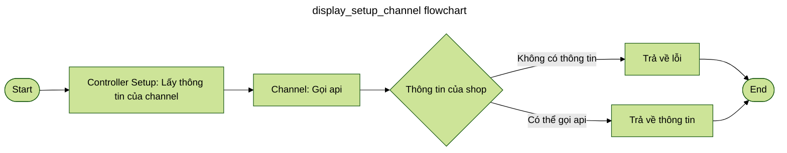

### Function: `set_channel_identifier`
> set_channel_identifier là một function để lưu lại thông tin của channel
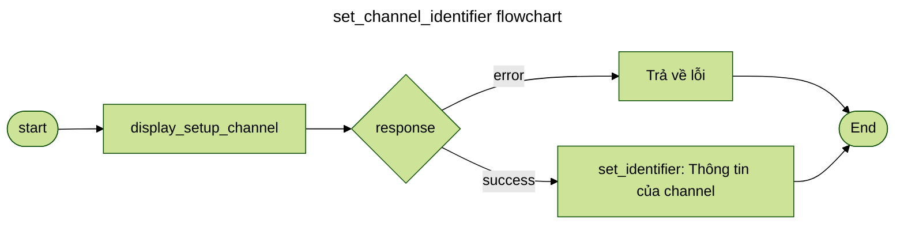

### Function: `Display_pull_channel`
> Thực hiện việc gọi api đến channel để lấy số lượng của `entity` cần pull. Sau khi lấy được số lượng thực hiện việc lưu vào `_state` của `entity` tương ứng
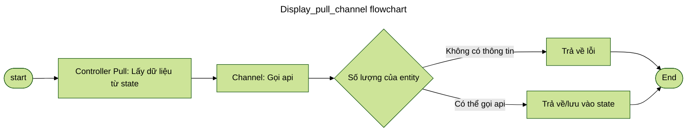

### Function: `get_{entity}_main_export`
> Thực hiện việc gọi APi để lấy dữ liệu của `entity` theo phân trang. Trả về *data_pack* chứa dữ liệu của `entity`
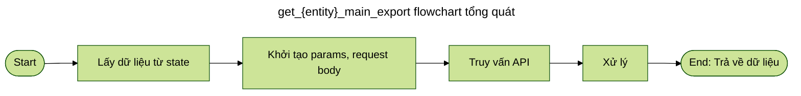

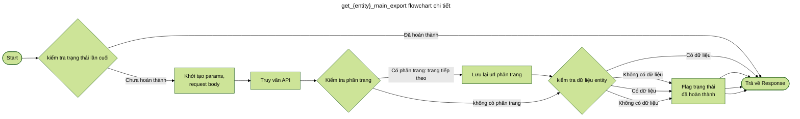

### Function: `get_{entity}_ext`
> Thực hiện việc bổ sung thêm dữ liệu của `entity` vào data_pack. Thường là các dữ liệu mà không thể lấy được thông qua api đâu tiên 
Ex: metafield của product trong shopify
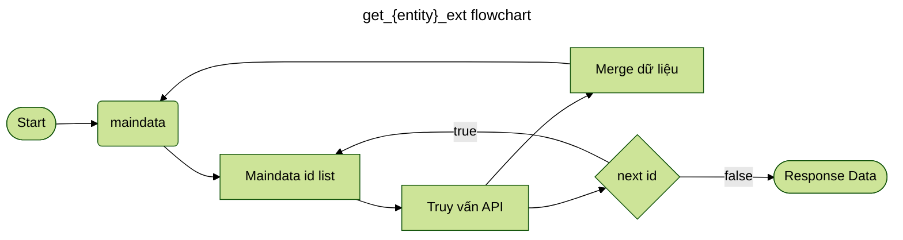

### Function: `convert_{entity}_import`
> Thực hiện việc chuyển đổi dữ liệu của `entity` thành dữ liệu của `entity` trong database. Cấu trúc của `entity` trong database được định nghĩa thông qua contruct class(model) của `entity` tương ứng
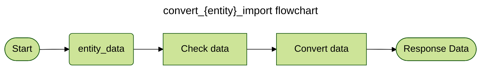

### Function: `{entity}_import`
> Thực hiện việc lưu dữ liệu của `entity` vào database *Đối với file warehouse*
Thực hiện việc import dữ liệu của `entity` vào platform *Đối với file channel*

---
## Action

### Action: `Setup channel`
> Setup channel Là một action để lấy và kiểm tra thông tin của channel
- function required: 
    + [`get_api_info: ->(dict)`](#function-get_api_info)
    + [`get_channel_info: ->(Response)`](#function-get_channel_info)
    + [`set_channel_identifier: ->(Response)`](#function-set_channel_identifier)
- Flow:
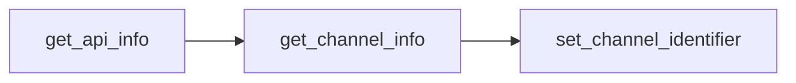
- Process:
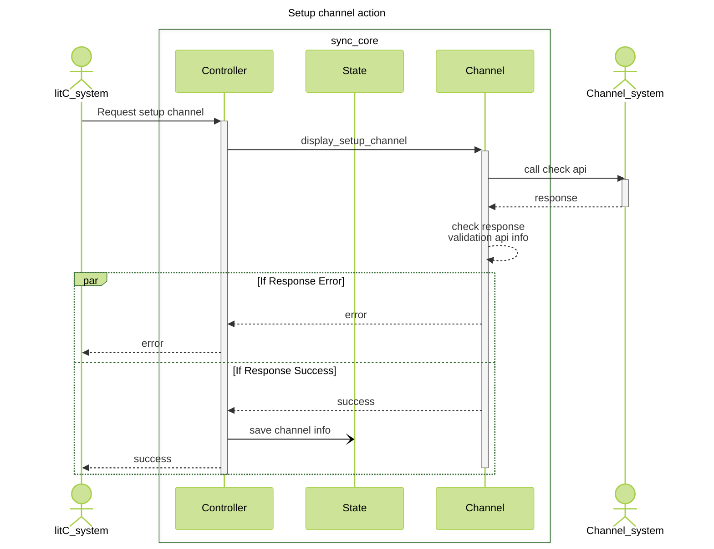

### Action: `Pull channel`
> Pull channel là một action để lấy thông tin(product,category,order,...) từ channel channel
- function required:
    - **In Channel**
        + [`Display_pull_channel: ->(Response)`](#function-Display_pull_channel)
        + [`get_{entity}_main_export: ->(Response: entity_Data)`](#function-get_{entity}_main_export)
        + [`get_{entity}_ext: ->(Response: entity_Data)`](#function-get_{entity}_ext)
        + [`convert_{entity}_import: ->(entity_Data)`](#function-convert_{entity}_import)
    - **In Warehouse**
        + `{entity}_import`: Thực hiện việc lưu dữ liệu của `entity` vào database
        + `after_{entity}_import`: Hâu xử lý sau khi lưu dữ liệu của `entity` vào database
> **Note:** `"entity"` là tên của `entity` cần pull  
function `{entity}_import` và `after_{entity}_import` được xử lý tại file warehouse.
còn lại sẽ được xử lý tại file channel tương ứng với channel
- Flow:
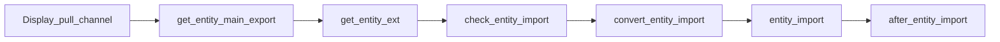
- Process:
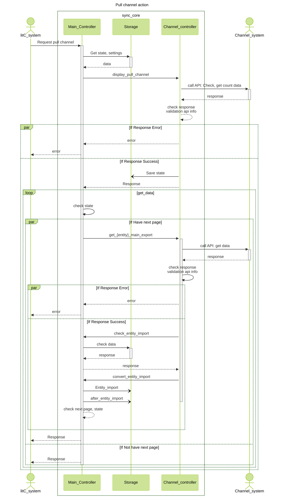