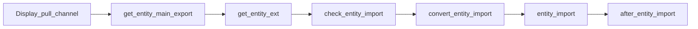

# Pseudo code for all functions and actions
---
## Action
### Action: `Setup channel`
    Setup channel Là một action để lấy và kiểm tra thông tin của channel
- function required: 
    + `get_api_info: ->(dict)`: Trả về thông tin cần thiết để gọi api của channel
        Ex: A shopify channel will need: shop_name, api_password so this function will return a dict with 2 keys: shop_name and api_password
    + `get_channel_info: ->(Response)`: Gọi và kiểm tra thông tin đã được cung cấp bởi channel
    + `set_channel_identifier: ->(Response)`: Lưu lại thông tin của channel
- Flow:
``` get_api_info -> display_setup_channel -> set_channel_identifier ```
- Chart:
    + display_setup_channel
    ```mermaid
    flowchart LR
        Start([Start]) -->A[Controller Setup: Lấy thông tin của channel ] --> B[Channel: Gọi api] --> C{Thông tin của shop} 
        C --> |Không có thông tin| E[Trả về lỗi] --> End([End])
        C --> |Có thể gọi api| F[Trả về thông tin] --> End
    ```
    + set_channel_identifier
    With return value of 'display_setup_channel' function
    ```mermaid 
    flowchart LR
    A[display_setup_channel] --> b{response}
    b --> |error| c[Trả về lỗi]
    b --> |success| d[set_identifier: Thông tin của channel]
    ```
    + Process:
    ```mermaid
    sequenceDiagram
        participant C as Controller
        participant B as Channel
        participant A as Action
        C->>A: get_api_info
        A->>B: display_setup_channel
        B->>A: response
        A->>A: check response
        A->>A: set_channel_identifier
        A->>C: return
    ```
### Action: `Pull channel`
    Pull channel là một action để lấy thông tin(product,category,order,...) từ channel channel
- function required(for channel file only):
    + `Display_pull_channel: ->(Response)`: Thực hiện việc gọi api đến channel để lấy số lượng của `entity` cần pull. Sau khi lấy được số lượng thực hiện việc lưu vào `_state` của `entity` tương ứng
    + `get_{entity}_main_export: ->(Response: entity_Data)`: Thực hiện việc gọi APi để lấy dữ liệu của `entity` theo phân trang. Trả về data_pack chứa dữ liệu của `entity`
    + `get_{entity}_ext: ->(Response: entity_Data)`: Thực hiện việc bổ sung thêm dữ liệu của `entity` vào data_pack. Thường là các dữ liệu mà không thể lấy được thông qua api đâu tiên 
        Ex: metafield của product trong shopify
    + `check_{entity}_import`: (WIP)
    + `convert_{entity}_import: ->(entity_Data)`: Thực hiện việc chuyển đổi dữ liệu của `entity` thành dữ liệu của `entity` trong database. Cấu trúc của `entity` trong database được định nghĩa thông qua contruct class(model) của `entity`
    + `{entity}_import`: Thực hiện việc lưu dữ liệu của `entity` vào database
    + `after_{entity}_import`: Hâu xử lý sau khi lưu dữ liệu của `entity` vào database
- Flow:

- Chart:
    + Display_pull_channel
    ```mermaid
    ---
    title: Display_pull_channel flowchart
    ---
    flowchart LR
        A[Controller Pull: Lấy dữ liệu từ state ] --> B[Channel: Gọi api] --> C{Số lượng của entity} 
        C --> |Không có thông tin| E[Trả về lỗi]
        C --> |Có thể gọi api| F[Trả về/lưu vào state]
    ```

    + get_{entity}_main_export
    ```mermaid 
    ---
    title: get_{entity}_main_export flowchart tổng quát
    ---
    flowchart LR
     Start([Start])-->A[Lấy dữ liệu từ state] --> B[Khởi tạo params, request body] --> C[Truy vấn API] --> D[Xử lý] --> End([End: Trả về dữ liệu])
    ```

    ```mermaid
    ---
        title: get_{entity}_main_export flowchart chi tiết
        config: 
            theme: forest
            curve: basis 
    ---
    flowchart LR
    START([Start])-->A{kiểm tra trạng thái lần cuối}
    A --> |Đã hoàn thành| End([Trả về Response])
    A --> |Chưa hoàn thành| B[Khởi tạo params,<br>request body] --> C[Truy vấn API] --> D{Kiểm tra phân trang}
    D --> |Có phân trang: trang tiếp theo| E[Lưu lại url phân trang] --> F1{kiểm tra dữ liệu entity}
    D --> |không có phân trang| F1{kiểm tra dữ liệu entity} 
    F1 --> |Có dữ liệu| End
    F1 --> |Không có dữ liệu| G[Flag trạng thái<br>đã hoàn thành] --> End
    F1 --> |Có dữ liệu| G --> End
    F1 --> |Không có dữ liệu| G --> End
    ```

    + get_{entity}_ext
    ```mermaid
    ---
        title: get_{entity}_ext flowchart
        config: 
            theme: forest
            curve: basis
    ---
    flowchart LR
    START([Start])-->Data(maindata) --> A{id}
    A --> |Có dữ liệu| B[Truy vấn API]
    %%MAP extdata to maindata[id]%%
    B --> C[Merge dữ liệu]
    C --> End([End])
    A --> End([End])
    ```
    ```mermaid
    sequenceDiagram 
        participant C as Controller
        participant B as Channel
        participant A as Action
        C->>B: get_{entity}_ext
        loop for id in maindata
            B->>A: id
            alt có id
                A->>A: Truy vấn API
                A->>B: API data
                B->>B: Maping data
            else không có id
                A->>B: flag[end]
            end
        end
        B->>C: Extdata
    ```
